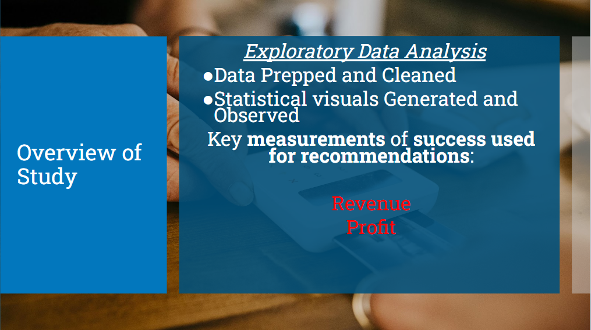

## Overview


In this study, an exploratory data analysis was held on movie data to determine recommendations for Microsofts platform. The data used was three sets of movie data from the websites Rotten Tomatoes, IMDB, and The Numbers. The data from Rotten Tomatoes was two dataframes, one was a dataframe of reviews, another was movie info, merged as one. The Numbers is a dataframe containing production budget data for movies since 1958. IMDb is an online database of information related to films, television series, home videos, video games, and streaming content online. The measurement of a successful movie was determined by the metrics of: profit, revenue, return on investment. The results revealed favorable outcomes for movies released in the summer and holiday season, higher revenues for popular genres like action and animation, and that higher budgets lead to higher revenues..to a point. The data was explored using the pandas library in python with a jupyter notebook. The data was prepped and cleaned, and then statistical visuals were generated for observations that would lead to data to inform recommendations. The data points to the necessity of budget control, releasing movies in the summer and holiday season, as well as sticking to those popular genres. 

 ## Business Problem


The business problem is that Microsoft wants to know what types of movies they should put out to their platform. 

Some questions that were considered while observing the data were:
1. What genres lead to the highest revenue at the box office?
2. Does a higher production budget lead to a higher profit?
3. What movie ratings have the best performance at the box office?
4. Who are the top  earning directors?
5. During what time of year will generate the most revenue and profit?

## The Data


The data is pulled from IMDb, Rotten Tomatoes and The Numbers. These three web pages are well-known, credible sources that contain a wealth of useful data for this analysis. Links to the websites are below:

Rotten Tomatoes: https://www.rottentomatoes.com/

The Rotten Tomatoes dataframe is a merged dataframe with a set of reviews on movies as well as information from those movies. The dataframe length is 54,672 data points when merged. The dataframe contains movie information such as their release date, genre, box office revenue, and director. 

ImDb: https://www.imdb.com/
The Numbers: https://www.the-numbers.com/

IMDb and The Numbers were merged, creating a dataframe of 43,969 data points. IMDb is a well known website containing information about movies including their release date, genre, and revenue at the box office. The Numbers dataframe contains data on the movies revenue as well as their budget, serving as a useful dataframe for calculating the most profitable movies. 


## Methods 



The methods in this study were employed to search for answers to the questions initialized from the business problem. 

The first step was the prepping and the cleaning of the data. The data was first prepped so that the following could be observed:

- revenue
- profit
- return on investment 

These measurements were looked at with consideration of the following:

- Time of Year Released
- Size of Production Budget
- Movie Genre
- Movie Rating

After the data was prepped, it was then filtered and aggregated to create visuals that helped to make observarions relating to the questions of the business problem. Bar charts and scatter plots, along with statistical metrics were used to help inform decision making on recommendations to Microsoft. 

## Results

## Which genres have the highest average Box Office Revenue?


Above we have a bar chart displaying the AverageBox Office Revenue by genre. Box office revenue is a metric that can be used to understand the excitement and appeal to the masses. In this visual, we can see that the genres of Scifi, Action and Adventure, and Kids/Family movies being the 3 highest revenue generators at the box office. However, still a strong showing is there for Romance, Mystery/Suspense, Animation and Comedy. The genres being in the order that they are should make sense, as some of the most popular movies are SciFi movies such as The Avengers and Star Wars, action movies like The Hunger Games, and Family movies like Finding Dory. 

## What is the best time of year to release movies?


This the slide above, whats displayed is the average net profit of movies grouped by the month. In this visual, it is clear that the months of May, June, July, November, and December are the most successful months for turning a profit during the year. The Spring/Summer and Holiday Season are the most popular months for movies, with days like May 4th aka "Star Wars" day during the spring, as well as the holidays being a great time for holiday movies. 

## What movie rating generates the most box office revenue?


In the visual displayed above, the average revenue of movie rating is observed. It is clear in this visual that the ratings of PG and PG-13 are of the highest potential for box office revenue. A possible, and probable reason for these results is the the restriction of age within the ratings of R and G. In the ratings of PG/PG13, the age bracket applies more to the masses of "movie-goers" and would in theory increase turnout.

## Does a higher production budget lead to a higher profit?


In the visual displayed above, we have a scatterplot displaying the relationship of the production budget and the net profit from The Numbers as the data source containing the production budget. In this study, a correlation coefficient was calculated to measure the strength of how the net profit will increase with a higher budget. With the correlation coefficient sitting around .64, this shows a positive, but medium strength correlation. As shown by the density of the data, the production budget appears to yield a more reliable return with a lower budget. As the budget increases, its easy to see that the variance of the results increases. As shown in the graph, there are examples of movies that have had great success at very high budgets, but also some that had a negative net profit at some of the highest budgets. 

## Results and Recommendations


For recommendations, the following is advised:
1. Keep the Budget Low to manage risk.
In the last slide, it is clear that a lower budget for the majority of the films more reliably turned a profit and as the budget increased past its median, the variance increased. Therefore the advice is to keep the budget lower to manage any risk or compensate for unforseen expenses when producing movies. 


2. Release Movies during the Summer and Holiday Season.
    
    It is clear that the best time of year to release movies is during the summer months and holiday season. 
    The most profitable months according to the data are during the months of: 
    - May 
    - June 
    - July
    - November
    - December 
    In the future, it would be good to look at particular holidays that are not in these months, such as halloween in October. 


3. Maxmize these genres:
    - Action, Adventure
    - Science-Fiction, Fantasy, Animation
    - Try to keep movies in the PG, PG13 Range

    In the analysis by genre, the genres above were the best performing at the box office along with the movie rating. Keeping the majority of your movies within these parameters will help to apply to the masses and take advantage of their popularity.

## Conclusion


- Big Takeaways
    - In this study, the clear take is that accessbility leads to a more successful outcome for movies in terms of revenue and profit. The movies that are produced during the most popular time and apply to the most amount of customers were the ones that will be most beneficial to have on Microsoft's platform. 

- Limitations
    - One aspect that was observed but ended up yielding no signicant outcome was the rating by reviewers. The only parameter that was considered was genre, so a dive deeper into the rating may be warranted.
    - Another aspect was the number of sources used in the study. One major question to answer always is how generalized ones findings would be if the study was expanded into larger datasets. Using more sources of data can lead to futher strengthen the reliability of the results. 

## Future Work


- Next Steps
Moving forward, it will be important to look at additional parameters that will help inform the aspects that make a successful film/ movie. The concept of time of year, genre and budget can be broken down into several sub categories and mapped against many different specifics related to the data. 

- Some possible parameters could be:
        - Demographics
        - Region/Country
        - Runtime
        - Directors
        - Actors
        - Movies released during certain holidays

Looking into other countries will be an interesting task, along with how the length of movies has changed over time. The most popular actors also certainly play a role in turnout for movies, so these more specific parameters could be an opportunity for Microsoft to explore in order to separate themselves from the competition.


```python

```
